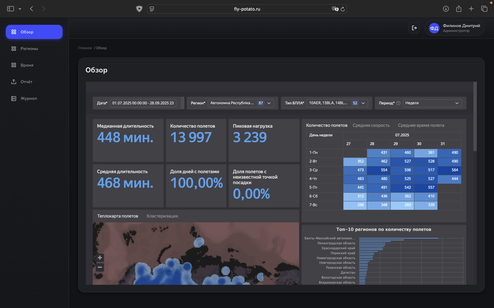

<h1 align="center">Fly Potato</h1>
<div align="center">
	
	
	
</div>
<p align="center">
<strong>Flight Potato</strong> – сервис для анализа количества и длительности полётов гражданских беспилотников в 
регионах Российской Федерации для определения полётной активности на основе данных Росавиации.
</p>

--- 

# Введение

Сервис предназначен для агрегирования, визуализации и аналитической обработки данных о полётах гражданских БПЛА по
субъектам РФ: парсинг формализованных сообщений, геопривязка к границам субъектов, расчёт базовых и расширенных метрик и
предоставление результатов пользователю через веб-интерфейс и экспорт. Цель — оперативная оценка активности полётов и
сокращение трудозатрат на подготовку отчётности.



# Руководство по установке PROD

> [!IMPORTANT]
> Этот README охватывает **только продакшн-установку**: периметр (NGINX + oauth2-proxy), backend (FastAPI), база (Postgres/PostGIS), Keycloak (SSO), мониторинг, и подключение дашборда (DataLens). DEV-инструкции здесь **не приводятся**.

---

## 1) Архитектура (PROD)


> [!NOTE]
> Снаружи открыт **только 443/TCP → NGINX** (80/TCP опционально для 301 → 443). Все сервисы внутри без публичных портов.

---

## 2) Предварительные требования

* Хост(ы) Linux x86_64 (Ubuntu 22.04 / Debian 12 / RHEL 9).
* Docker ≥ 24 и docker compose v2 (плагин).
* Две сети (желательно): `dmz` (NGINX) и `internal` (остальные сервисы) **или** один хост с двумя docker-сетями.
* Внешний DNS: записи на ваш домен `YOUR_DOMAIN`.
* Валидные TLS-сертификаты (Let’s Encrypt или корп. PKI).
* Закрытый админ-доступ (VPN/бастион, SSH по ключам, MFA).

> [!WARNING]
> Часы на всех узлах должны быть синхронизированы (NTP), иначе сломаются OIDC/JWT и TLS (ошибки по времени).

---

## 3) Секреты и окружения

Создайте `.env.prod` из примера:

```bash
cp .env.example .env.prod
chmod 600 .env.prod
```

> [!IMPORTANT]
> Секреты храните в Vault/SSM/Pass. На хостах — только runtime-копии (права `600`). Регулярная ротация (≥ раз в 90 дней).

---

## 4) NGINX (периметр)

Обновите конфиг:

* `server_name` → ваш домен: `example.ru www.example.ru`.
* Пути `ssl_certificate` и `ssl_certificate_key` → настоящие файлы сертификата.
* Проксируйте пути:

  * `/oauth2/*` → `oauth2-proxy:4180`
  * `/api/*` → `backend:80`
  * `/sso/*` → `keycloak:8080`

> [!NOTE]
> Включите HSTS, OCSP stapling, разумные `proxy_*` заголовки (`X-Forwarded-*`), rate-limit и базовые защищённые шифросьюты TLS 1.2/1.3.

---

## 5) Keycloak (SSO)

1. Войти в Keycloak → создать **Realm**.
2. Clients → Create client:
   * **Client type**: `OpenID Connect`
   * **Client ID**: `oauth2-proxy` (или своё)
   * **Name**: по желанию
3. Next:
   * **Root URL**: `<ВАШ_ДОМЕН>`
   * **Valid redirect URIs**: `<ВАШ_ДОМЕН>/oauth2/callback`
   * **Web origins**: `<ВАШ_ДОМЕН>`
   * **Home URL** (опц.): `<ВАШ_ДОМЕН>`
4. Next:
   * **Client authentication**: `ON` (тип клиента: `confidential`)
   * **Standard Flow**: `ON`
   * Сохранить.
5. На вкладке **Credentials** скопировать **Client secret** — он нужен `oauth2-proxy`.

**Protocol Mappers** (клиент → Mappers):

Добавьте мапперы, чтобы нужные поля попадали в токены:

  * `email`:

    * **Mapper type**: `User Property`
    * **Property**: `email`
    * **Token Claim Name**: `email`
    * **Add to ID token**: `ON`, **Add to access token**: `ON`
  * `preferred_username`:

    * **Mapper type**: `User Property`
    * **Property**: `username`
    * **Token Claim Name**: `preferred_username`
    * **Add to ID token**: `ON`, **Add to access token**: `ON`
  * (опц.) `groups`:

    * **Mapper type**: `Group Membership`
    * **Token Claim Name**: `groups`
    * (по желанию) Full group path

> [!IMPORTANT]
> Трафик к админке Keycloak держите **только** из внутренней сети/VPN. Сам Keycloak публикуется наружу **только** за `/sso/*` через NGINX.

---

## 6) База данных (Postgres/PostGIS)

* БД недоступна снаружи; слушает только во внутренней сети на `5433`.
* Создайте пользователя `app_user` и отдельную **read-only** учётку для DataLens.
* Включите резервное копирование (см. раздел ниже) и аудит подключений.

---

## 7) Мониторинг (Prometheus/Alertmanager)

* Prometheus скрапит: `backend:80/metrics`, `postgres_exporter:9187`, `sql_exporter:9399`, `node_exporter:9100`.
* Access — только из VPN/internal. Настройте алерты: `api_5xx_rate>1%`, `latency_p95>0.5s`, `db_down`, `cert_expiry<14d`, `oauth2_errors_spike`, `container_restarts>3/10m`.

---

## 8) Развёртывание (шаги)

> [!IMPORTANT]
> Откройте наружу **только 443/TCP → NGINX** (опционально 80/TCP для редиректа).

1. **Подготовка окружения**

   ```bash
   git clone https://github.com/limness/mode-float
   cd mode-float
   cp .env.example .env.prod
   # заполните .env.prod, замените домен/секреты
   ```

2. **Запуск базы и миграций**

   ```bash
   docker compose --profile core up -d postgres
   docker compose --profile core run --rm migration
   ```

3. **Запуск backend**

   ```bash
   docker compose --profile core up -d backend
   ```

4. **Запуск SSO-цепочки** (Keycloak → oauth2-proxy → NGINX)

   ```bash
   docker compose --profile auth up -d keycloak
   docker compose --profile auth up -d oauth2-proxy nginx
   ```

5. **Мониторинг**

   ```bash
   docker compose --profile monitoring up -d
   ```

> [!NOTE]
> Если у вас есть `Makefile` с таргетом `all-prod`, можно использовать: `make all-prod`.

---

## 9) Проверка готовности

* **Health API**: `curl -f https://YOUR_DOMAIN/api/health`
* **Метрики** (через периметр, если проксируете): `curl -I https://YOUR_DOMAIN/api/metrics`
* **Авторизация**: открыть `https://YOUR_DOMAIN/oauth2/start` → убедиться, что редиректит в Keycloak, логин проходит.
* **TLS**: срок действия сертификата > 14 дней; HSTS включён.

> [!WARNING]
> Если `401/403` на `/api/*`, проверьте: (1) валидность токена от oauth2-proxy; (2) корректность `X-Forwarded-*`; (3) часы (NTP).

---

## 10) Дашборд (DataLens)

### 10.1 Прямое подключение к БД (read-only)

1. Создайте `ro`-пользователя в Postgres и ограничьте права (только нужные схемы/вьюхи).
2. Настройте соединение в DataLens: хост `PG`, порт `5433`, пользователь/пароль `ro`.

### 10.2 Встраивание в сайт (iframe + JWT из backend)

---

## 11) Резервное копирование и восстановление (кратко)

### Бэкапы

* Ежедневно: `pg_dump -Fc` **или** `pg_basebackup`.
* Постоянно: архив WAL (для PITR). Храните 14–30 дней.

Примеры:

```bash
# полный дамп ежедневно
PGPASSWORD=*** pg_dump -h postgres -U app_user -d float_mode -Fc \
  -f /backups/float_$(date +%Y%m%d).dump

# включение WAL-архива (postgresql.conf)
# wal_level=replica
# archive_mode=on
# archive_command='test ! -f /wal-archive/%f && cp %p /wal-archive/%f'
```

### Восстановление (PITR, кратко)

```bash
# остановить приложение
docker compose stop backend

# пересоздать БД из дампа
dropdb   -h postgres -U app_user float_mode || true
createdb -h postgres -U app_user float_mode
pg_restore -h postgres -U app_user -d float_mode -j 4 /backups/float_YYYYMMDD.dump

# если PITR — подготовить recovery и доступ к /wal-archive, затем старт postgres

# запустить приложение
docker compose start backend
```

> [!IMPORTANT]
> Раз в неделю проводите тестовое восстановление на стенде. Это единственный надёжный способ проверить пригодность бэкапов.

---

## 12) Обновления/релизы

* Пины образов по `sha256` для PROD.
* Порядок: **бэкап → pull/up → миграции → smoke-тест**.
* Откат: теги назад + `alembic downgrade <rev>`.
* SLO: доступность API ≥ 99.5%, P95 latency `/api/*` ≤ 500 мс, 5xx ≤ 1%/5м.
