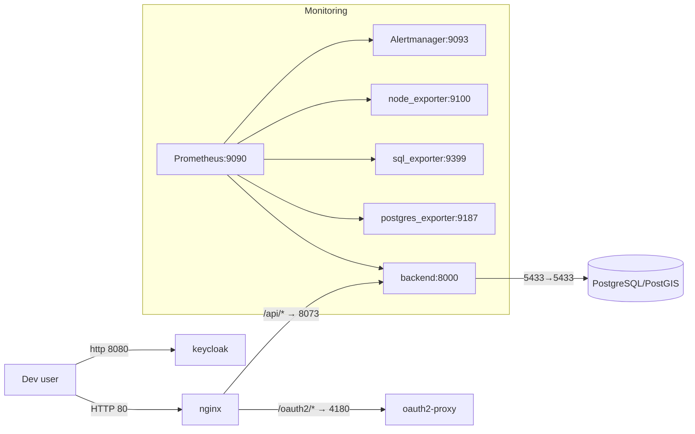
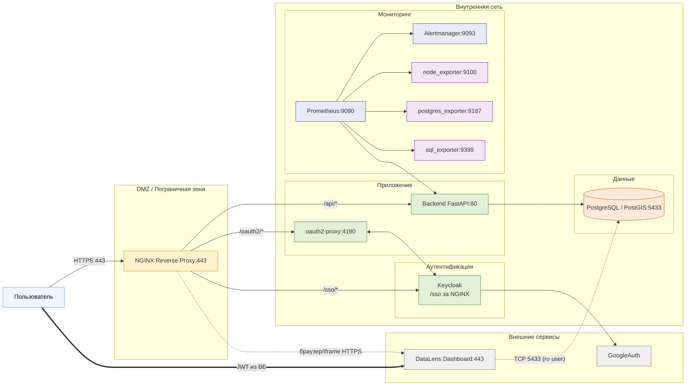
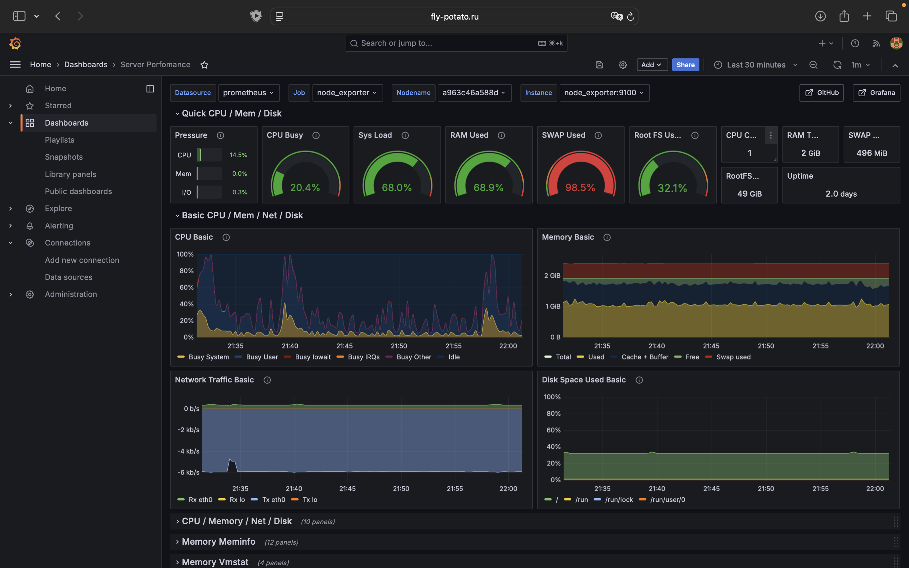

# Архитектура и состав

## Компоненты и профили

- core: postgres (PostGIS), migration (alembic), backend (FastAPI).
- monitoring: prometheus, alertmanager, node_exporter, postgres_exporter, sql_exporter.
- auth: keycloak, oauth2-proxy, nginx.

## Профили запуска

- Только ядро: docker compose --profile core up -d
- Ядро + авторизация: docker compose --profile core --profile auth up -d
- Всё (DEV полный): docker compose --profile all up -d

## Схема

### DEV



### PROD



## Порты/протоколы

### DEV

| Сервис             | Порт (хост → контейнер) | Протокол | Назначение                   |
|--------------------|-------------------------|----------|------------------------------|
| postgres (PostGIS) | **5433 → 5433**         | TCP      | БД приложения                |
| backend            | **8073 → 8000**         | HTTP     | API/health/metrics           |
| nginx              | **80 → 80**             | HTTP     | Реверс-прокси (dev, без TLS) |
| keycloak           | **8080 → 8080**         | HTTP     | IdP (Realm import)           |
| oauth2-proxy       | **4180 → 4180**         | HTTP     | OIDC прокси                  |
| prometheus         | **9090 → 9090**         | HTTP     | Метрики/графы                |
| alertmanager       | **9093 → 9093**         | HTTP     | Алерты                       |
| node_exporter      | **9100 → 9100**         | HTTP     | Метрики хоста                |
| postgres_exporter  | **9187 → 9187**         | HTTP     | Метрики БД                   |
| sql_exporter       | **9399 → 9399**         | HTTP     | Кастомные SQL-метрики        |

### PROD

В PROD наружу открыт только **HTTPS 443 → NGINX** (и опц. HTTP 80 для редиректа).
Все остальные сервисы не публикуют порты наружу и доступны лишь из внутренней сети.

#### Внешние входящие (ingress)

| Сервис           | Порт (внешний → внутренний) | Протокол | Назначение                       |
|------------------|-----------------------------|----------|----------------------------------|
| **nginx**        | **443 → 443**               | HTTPS    | Единственная внешняя точка входа |
| (опц.) **nginx** | **80 → 80**                 | HTTP     | Редирект на HTTPS 443            |

#### Внутренние сервисы (без публикации наружу)

| Сервис                 | Порт (внутри сети) | Протокол | Назначение                                            |
|------------------------|-------------------:|----------|-------------------------------------------------------|
| **backend**            |                 80 | HTTP     | API/health/metrics (доступ только через nginx)        |
| **oauth2-proxy**       |               4180 | HTTP     | OIDC-прокси (nginx ↔ oauth2-proxy)                    |
| **keycloak**           |               8080 | HTTP     | IdP; публикуется наружу **только** через nginx /sso/* |
| **postgres (PostGIS)** |               5433 | TCP      | База данных (доступ только из внутренней сети)        |
| **prometheus**         |               9090 | HTTP     | Мониторинг (доступ из VPN/внутренней сети)            |
| **alertmanager**       |               9093 | HTTP     | Оповещения (внутренняя сеть/VPN)                      |
| **node_exporter**      |               9100 | HTTP     | Метрики хоста (внутренняя сеть)                       |
| **postgres_exporter**  |               9187 | HTTP     | Метрики БД (внутренняя сеть)                          |
| **sql_exporter**       |               9399 | HTTP     | Кастомные SQL-метрики (внутренняя сеть)               |

#### Исходящие подключения (egress allow-list)

| Источник          | Назначение              | Порт | Протокол | Назначение          |
|-------------------|-------------------------|-----:|----------|---------------------|
| **backend/nginx** | DNS                     |   53 | UDP/TCP  | Разрешение имён     |
| **nginx/backend** | внешние IdP (если есть) |  443 | HTTPS    | OIDC/OpenID Connect |

#### Особый случай: DataLens (прямой доступ к БД)

| Источник            | Назначение   |     Порт | Протокол | Условие безопасности    |
|---------------------|--------------|---------:|----------|-------------------------|
| **Yandex DataLens** | **postgres** | **5433** | TCP      | Только read-only учётка |

# Требования к инфраструктуре

## Платформа и версии

- ОС хостов: Linux x86_64 (Ubuntu 22.04 LTS / Debian 12 / RHEL 9).
- Контейнеризация: Docker ≥ 24, docker compose v2 (plugin).

## Ресурсы и sizing (минимум для PROD)

| Узел/роль            | vCPU |     RAM | Диск (тип)      | Примечания                      |
|----------------------|-----:|--------:|-----------------|---------------------------------|
| NGINX + oauth2-proxy |  1–2 |  1–2 ГБ | 10 ГБ (SSD)     | В DMZ; TLS, rate-limit          |
| Backend (FastAPI)    |    2 |  2–4 ГБ | 10–20 ГБ (SSD)  | Горизонтально масштабируется    |
| Postgres/PostGIS     |    4 | 8–16 ГБ | 200+ ГБ (NVMe)  | Отдельный диск под данные + WAL |
| Prometheus           |    2 |    4 ГБ | 50–200 ГБ (SSD) | Ретеншн 7–30 дней               |
| Alertmanager         |    1 |    1 ГБ | 5 ГБ            | Небольшой                       |
| Экспортеры           |    1 |    1 ГБ | 5 ГБ            | node/postgres/sql exporter      |
| Keycloak             |    2 |    4 ГБ | 20 ГБ (SSD)     | KC_PROXY=edge, /sso за nginx    |

## Сеть и сегментация

- Зоны: DMZ (только NGINX:443) и internal (backend, DB, Keycloak, мониторинг).
- Ingress: извне открыт только 443/TCP → nginx (80/TCP — опционально для 301 → 443).
- Внутренние порты: backend:80, oauth2-proxy:4180, keycloak:8080, postgres:5433, prom:9090, am:9093, exporters:
  9100/9187/9399 — без публикации наружу.
- Egress allow-list: DNS:53, NTP:123, S3/объектное:443 (если используется), SMTP:587/465 (если нужно), внешние IdP/SSO:
  443 (по необходимости).
- MTU/overlay: MTU 1500 (или 1450 при overlay/VPN). Включить MSS-clamp на периметре при IPSec/WireGuard.

## DNS / TLS / Время

- DNS: A/AAAA/CNAME для YOUR_DOMAIN, внутренние A-записи для postgres, keycloak, prometheus и т.д.
- TLS: 1.2/1.3, валидные цепочки (Let’s Encrypt/корп. PKI), HSTS (макс. возраст ≥ 31536000, includeSubDomains), OCSP
  stapling.
- Ротация сертификатов: автоматическая, предупреждение за ≥ 14 дней до истечения.
- NTP: синхронизация (±1 сек) на всех узлах: критично для OIDC/JWT и TLS.

## Доступы и безопасность

- Админ-доступ: только через VPN/бастион, SSH по ключам, MFA для привилегий.
- oauth2-proxy (prod)
    - --cookie-secure=true
    - --cookie-httponly=true
    - --cookie-samesite=lax
    - --pass-access-token=true
- Keycloak (prod)
    - KC_PROXY=edge
    - KC_HOSTNAME=YOUR_DOMAIN
    - KC_HTTP_RELATIVE_PATH=/sso, доступ в админку только из internal/VPN.
- Логи: без секретов/PII; маскирование токенов/паролей на уровне приложения и прокси.

## База данных (Postgres/PostGIS)

- Резервное копирование: полный dump ежедневно (pg_dump/pg_basebackup), WAL — постоянно; хранение ≥ 14–30 дней.
- Учётки: отдельный пользователь read-only для DataLens; ограниченные схемы/вьюхи; аудит подключений.

## Мониторинг и алерты

- Prometheus: доступ из внутренней сети/VPN; scrape backend /metrics, exporters, БД.
- SLI/SLO ориентиры: доступность API ≥ 99.5%, P95 latency /api/* ≤ 500 мс, 5xx ≤ 1%/5м.
- Алерты базовые
    - api_5xx_rate > 1% (5m)
    - latency_p95 > 0.5s (5m)
    - db_down==1
    - cert_expiry_days < 14
    - oauth2_errors_spike
    - container_restarts > 3/10m
- Логи/ретеншн: централизованный сбор (Loki/ELK), хранение 30–90 дней; аудит (Keycloak) 180–365 дней.

## Интеграция с DataLens

- Встраивание:
    - backend выпускает JWT для iframe
    - ротация ключей JWT
    - ограничение origin (CSP).
- Прямой доступ к БД:
    - read-only учётка
    - запрет публикации ports: наружу.

## Разделение сред

- DEV/TEST/PRE-PROD/PROD: изоляция сетей и секретов; доступ к PROD-БД только с PROD-сервисов; запрет кросс-доступа.
- Артефакты: образы с фиксированным sha256 для PROD, единый реестр (private).

# Установка и запуск

## DEV

### Подготовка окружения

```bash
git clone https://github.com/limness/fly-potato
cd fly-potato

cp .env.example .env.dev
```

### База данных (PostGIS) и миграции

``` bash
docker compose --profile core up -d postgres
docker compose --profile core run --rm migration
```

### backend

```bash
docker compose --profile core up -d backend
curl -f http://localhost:8073/health
curl -f http://localhost:8073/metrics | head
```

### Авторизация (Keycloak + oauth2-proxy + nginx)

```bash
docker compose --profile auth up -d keycloak
# keycloak dev на http://localhost:8080 (admin/admin по умолчанию из env)
# импорт realm: volume ./data/keycloak-import смонтирован, команда '--import-realm' уже задана

docker compose --profile auth up -d oauth2-proxy nginx
# dev callback настроен как http://localhost/oauth2/callback
```

### Мониторинг

```bash
docker compose --profile monitoring up -d
# prometheus: http://localhost:9090
# alertmanager: http://localhost:9093
```

## PROD

### Предварительные требования

- Подготовлен сервер(а) PROD: dmz (nginx) и internal (backend, postgres, keycloak, monitoring) или один хост с двумя
  docker-сетями.
- Открыт наружу только 443/TCP → nginx (80/TCP опц. для редиректа).
- Выпущены TLS-сертификаты для YOUR_DOMAIN (Let’s Encrypt или корпоративные).
- Созданы секреты/учётки
    - POSTGRES_PASSWORD, POSTGRES_URI для бэкенда.
    - Keycloak
        - KC_HOSTNAME=YOUR_DOMAIN
        - KC_PROXY=edge
        - realm
        - confidential-клиент (client_id/secret)
    - oauth2-proxy
        - OAUTH2_CLIENT_ID
        - OAUTH2_CLIENT_SECRET
        - OAUTH2_COOKIE_SECRET
    - Postgres read-only пользователь для DataLens
- .env.prod создан из .env.example

### Подготовка конфигов

```bash
cp .env.example .env.prod
```

### Настройка Nginx

Замените в конфиге:

- server_name — ваш домен (например, example.ru www.example.ru);
- ssl_certificate / ssl_certificate_key — настоящие пути к сертификатам.

### Настройка Keycloak

1. Войти в Keycloak → создать **Realm**.
2. Clients → Create client:
    * **Client type**: OpenID Connect
    * **Client ID**: oauth2-proxy (или своё)
    * **Name**: по желанию
3. Next:
    * **Root URL**: <ВАШ_ДОМЕН>
    * **Valid redirect URIs**: ВАШ_ДОМЕН>/oauth2/callback
    * **Web origins**: <ВАШ_ДОМЕН>
    * **Home URL** (опц.): <ВАШ_ДОМЕН>
4. Next:
    * **Client authentication**: ON (тип клиента: confidential)
    * **Standard Flow**: ON
    * Сохранить.
5. На вкладке **Credentials** скопировать **Client secret** — он нужен oauth2-proxy.

**Protocol Mappers** (клиент → Mappers):

Добавьте мапперы, чтобы нужные поля попадали в токены:

* email:

    * **Mapper type**: User Property
    * **Property**: email
    * **Token Claim Name**: email
    * **Add to ID token**: ON, **Add to access token**: ON
* preferred_username:

    * **Mapper type**: User Property
    * **Property**: username
    * **Token Claim Name**: preferred_username
    * **Add to ID token**: ON, **Add to access token**: ON
* (опц.) groups:

    * **Mapper type**: Group Membership
    * **Token Claim Name**: groups
    * (по желанию) Full group path

### Запуск

```bash
make all-prod
```

## DataLens

### Предпосылки и безопасность

- Прямой доступ DataLens к БД: по read-only учётке.
- Минимизируйте права: отдельная роль, доступ к нужным схемам/вьюхам, аудит подключений.

### Подготовка

1. Требуется аккаунт в Yandex Cloud / DataLens с доступом к коллекциям.
2. Дождитесь готовности каталога/облака в YC.

### Импорт воркбука

- Скачайте [файл](https://github.com/limness/fly-potato/blob/dev/fly-potato-workbook.json) воркбука
- Зайдите на [страницу](https://datalens.ru/collections) с Воркбуками
- В правом верхнем углу нажмите кнопку Создать
- Импортируйте ранее скаченный файл
- Заполните полня названия и описания

### Подключение к БД

- Внутри вашего воркбука → вкладка Подключения → выбрать flight-database-connection.
- Заполнить
    - Каталог: ваш текущий
    - Хост: IP/имя сервера Postgres
    - Порт: 5433
    - Пользователь и пароль
- Сохранить и проверить соединение.

### Встраивание дашборда в сайт (через JWT)

Для встраивания DataLens в iframe бэкенд выдаёт JWT, который DataLens принимает для SSO/доступа.

Для создания .pem файла для генерации JWT токенов перейдите на страницу вашего воркбука, в правом верхнем углу 
нажмите на три точки, перейдите во вкладку "Ключи для встраивания", создайте ключ и поместите файл в папку certs и 
укажите путь к этому файл в .env файле (DATALENS_PRIVATE_KEY_PATH).

Далее для каждого дашборда в воркбуке перейдите во вкладку "Настройки встраивания" (три точки справа от названия 
дашборда), и выберите ваш JWT ключ. В появится уникальный ID, который следует перенести в файл frontend/src/App.tsx.

```
const DATALENS_IDS: Record<string, string | undefined> = {
  overview: normalizeEmbedId(import.meta.env.VITE_DATALENS_OVERVIEW_ID) ?? АЙДИ ДАШБОРДА ОБЗОР,
  regions: normalizeEmbedId(import.meta.env.VITE_DATALENS_REGIONS_ID) ?? 'АЙДИ ДАШБОРДА РЕГИОНЫ',
  time: normalizeEmbedId(import.meta.env.VITE_DATALENS_TIME_ID) ?? 'АЙДИ ДАШБОРДА ВРЕМЯ',
}
```


# Конфигурация (DEV + PROD)

## Переменные окружения

| Переменная             | Значение по умолчанию | Описание                                |
|------------------------|-----------------------|-----------------------------------------|
| APP_TITLE              | Fly Potato            | Название приложения                     |
| APP_VERSION            | 0.1.0                 | Версия приложения                       |
| APP_DEBUG              | False                 | Режим отладки (True/False)              |
| APP_PROMETHEUS_HOST    | 0.0.0.0               | Хост, на котором запускается приложение |
| APP_PROMETHEUS_PORT    | 8000                  | Порт приложения                         |
| POSTGRES_URI           | –                     | URI подключения к базе данных           |
| GRAFANA_CLOUD_USERNAME | –                     | Имя пользователя Grafana Cloud          |
| GRAFANA_CLOUD_TOKEN    | –                     | Токен Grafana Cloud для метрик          |
| DATA_SOURCE_NAME       | –                     | Имя/ссылка источника метрик             |

# Зависимости (DEV + PROD)

| Библиотека            | Минимальная версия | Назначение                                                         |
|-----------------------|--------------------|--------------------------------------------------------------------|
| **python**            | ^3.12              | -                                                                  |
| **sqlalchemy**        | ^2.0.39            | ORM и конструктор SQL-запросов                                     |
| **alembic**           | ^1.15.1            | Инструмент миграций для SQLAlchemy                                 |
| **asyncpg**           | ^0.30.0            | Асинхронный драйвер PostgreSQL                                     |
| **pydantic-settings** | ^2.8.1             | Управление настройками через Pydantic                              |
| **greenlet**          | ^3.1.1             | Лёгкие сопрограммы (используются SQLAlchemy для «зелёных потоков») |
| **pydantic**          | ^2.11.7            | Валидация данных и создание моделей                                |
| **geopy**             | ^2.4.1             | Геокодирование и географические вычисления                         |
| **numpy**             | ^2.3.1             | Научные вычисления и работа с массивами                            |
| **colorlog**          | ^6.9.0             | Раскрашенный логгинг                                               |
| **httpx**             | ^0.28.1            | Асинхронный HTTP-клиент                                            |
| **prometheus-client** | ^0.22.1            | Метрики и мониторинг Prometheus                                    |
| **aiohttp**           | ^3.12.14           | Асинхронный HTTP-клиент/сервер                                     |
| **fastapi**           | ^0.117.1           | Веб-фреймворк для создания REST/GraphQL API                        |
| **uvicorn**           | ^0.37.0            | ASGI-сервер для запуска FastAPI и других ASGI-приложений           |
| **pandas**            | ^2.3.2             | Анализ и обработка табличных данных                                |
| **openpyxl**          | ^3.1.5             | Работа с Excel-файлами (XLSX)                                      |
| **geoalchemy2**       | ^0.18.0            | Геопространственные расширения для SQLAlchemy/PostGIS              |
| **pyjwt**             | ^2.10.1            | Работа с JSON Web Token (JWT)                                      |
| **python-multipart**  | ^0.0.20            | Парсинг multipart/form-data (загрузка файлов и форм в FastAPI)     |

# Резервное копирование и восстановление

## DEV

```bash
PGPASSWORD=postgres pg_dump -h localhost -p 5433 -U postgres -d float-mode -Fc \
  -f ./data/postgres-backups/float_$(date +%Y%m%d).dump
```

## PROD

- Ежедневно: полный дамп БД pg_dump -Fc **или** pg_basebackup.
- Постоянно: архив WAL (для PITR).

### Команды (пример)

```bash
# Полный дамп (ежедневно)
PGPASSWORD=*** pg_dump -h postgres -U app_user -d float_mode -Fc \
  -f /backups/float_$(date +%Y%m%d).dump

# Включить WAL-архив (postgresql.conf)
# wal_level=replica
# archive_mode=on
# archive_command='test ! -f /wal-archive/%f && cp %p /wal-archive/%f'
```

### Восстановление (PITR, кратко)

```bash
# Остановить приложение
docker compose stop backend

# Пересоздать БД из дампа
dropdb   -h postgres -U app_user float_mode || true
createdb -h postgres -U app_user float_mode
pg_restore -h postgres -U app_user -d float_mode -j 4 /backups/float_YYYYMMDD.dump

# (если PITR) — recovery.conf/standby.signal с recovery_target_time=...
# и доступом к /wal-archive, затем старт postgres

# Запустить приложение
docker compose start backend
```

### Политики

- Ретеншн: дампы 14–30 дней, WAL 7–14 дней.
- Еженедельно: тестовое восстановление на стенде.

# Мониторинг и оповещения

## Prometheus targets (пример)

```yaml
scrape_configs:
  - job_name: 'backend'
    static_configs: [ { targets: [ 'backend:8000' ] } ]
    metrics_path: /metrics

  - job_name: 'postgres_exporter'
    static_configs: [ { targets: [ 'postgres_exporter:9187' ] } ]

  - job_name: 'node_exporter'
    static_configs: [ { targets: [ 'node_exporter:9100' ] } ]

  - job_name: 'sql_exporter'
    static_configs: [ { targets: [ 'sql_exporter:9399' ] } ]
```

## Базовые правила (alert.rules.yaml)

- InstanceDown для backend и БД.
- Ошибки аутентификации (рост 401/403 на nginx в PROD; в DEV можно смотреть вручную по логам).
- P95 latency для /api/* (в DEV — информативно).


## Grafana
В системе есть панель мониторинга **Grafana** по адресу: **https://YOUR_DOMAIN/grafana**.
Учётные данные берутся из переменных окружения в файле **.env** (GF_SECURITY_ADMIN_USER и GF_SECURITY_ADMIN_PASSWORD). 
Эти логин/пароль задаются при деплое и используются для первого входа. 
Далее рекомендуются отдельные пользователи/роли и отключение дефолтных кредов. Grafana нужна, чтобы быстро смотреть состояние сервисов (доступность, ошибки, задержки, ресурсы) и разбирать инциденты — достаточно открыть нужный дашборд и выбрать интервал.
{fig-align=center width=100%}

# Доступы и безопасность

## DEV

- Всё доступно локально по HTTP; внешнюю публикацию DEV не делать.
- Ключи/секреты в .env.dev держать только локально; не коммитить.
- Для отладки ролей — использовать группы/клеймы в Keycloak (preferred_username, groups).

## PROD

- Периметр: наружу открыт только 443/TCP → nginx (опц. 80→443 редирект). Backend/DB/мониторинг без ports:.
- Доступ админов: только через VPN/бастион, SSH по ключам, MFA для привилегированных учёток.
- Секреты: в Vault/SSM/Pass; на узлах — только runtime (.env.prod с правами 600), ротация ≥ каждые 90 дней.
- oauth2-proxy, включены
    - cookie-secure
    - httponly
    - samesite=lax
    - прокидываем Authorization и access-token
- Keycloak: работает за /sso с KC_PROXY=edge, админка закрыта сетево (только internal/VPN).

# Эксплуатационные регламенты

## DEV

### Пересоздать БД

```bash
docker compose --profile core down -v
rm -rf ./data/postgres
docker compose --profile core up -d postgres
docker compose --profile core run --rm migration
```

### Горячая перезагрузка backend

```bash
docker compose --profile core up -d --build backend
```

### Логи быстрого доступа

```bash
docker compose logs -f backend
docker compose logs -f postgres
docker compose logs -f oauth2-proxy nginx keycloak

```

## PROD

- Eжесменно: короткий smoke через периметр (/health), взгляд на 5xx и P95; проверка свободного места БД и срока TLS
  (>14 дней).
- Еженедельно: тест восстановления бэкапа на стенде (в т.ч. PITR); проверка актуальности алертов и on-call контактов.
- Релиз: пины образов по sha256; порядок — бэкап → pull/up → миграции → smoke; откат — теги назад + alembic
  downgrade <rev>.
- Журналы/PII: маскирование секретов; централизованный сбор, ретеншн согласно политике (коротко сослаться на раздел про
  мониторинг).
- Инциденты: быстрая локализация (rate-limit/feature-flag/отключение интеграции), затем rollback/фикс; пост-мортем и
  CAPA в регламентные сроки.
