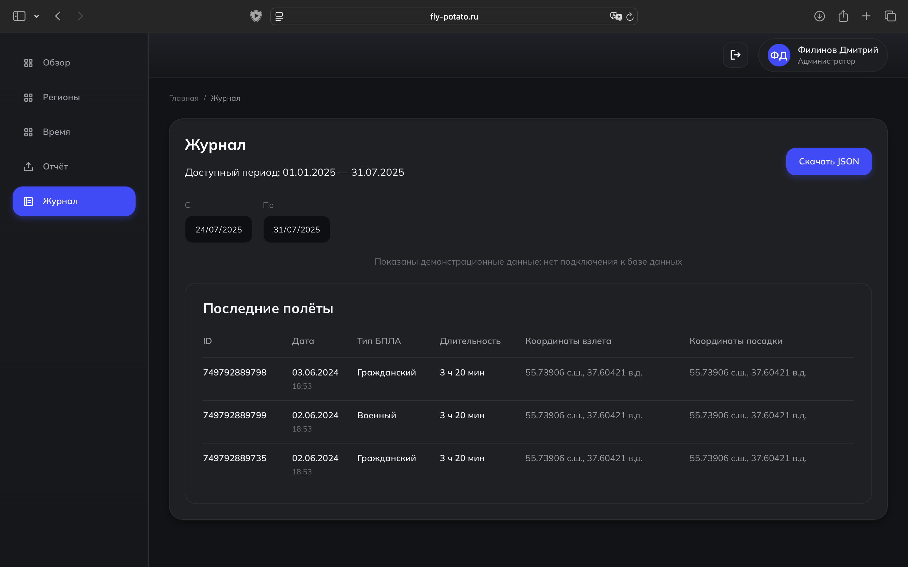
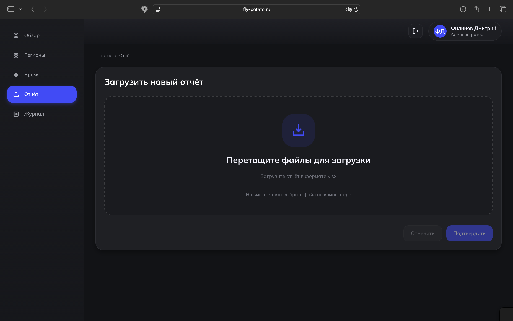

# Введение

## Назначение документа

Настоящее «Руководство пользователя» описывает правила работы с веб-интерфейсом сервиса анализа количества и
длительности полётов гражданских беспилотных летательных аппаратов (БПЛА) по регионам Российской Федерации. Документ
предназначен для конечных пользователей: операторов и администраторов системы. Он охватывает сценарии входа в систему,
работу с дашбордами «Обзор», «Регионы», «Время», просмотр «Журнала», и (для администраторов) экспорт данных и загрузку
отчётов в формате XLSX. Основанием для документа служит техническое задание на сервис анализа полётной активности на
базе данных Росавиации.

## Назначение и цели системы

Сервис предназначен для агрегирования, визуализации и аналитической обработки данных о полётах гражданских БПЛА, что
позволяет оперативно оценивать полётную активность по субъектам РФ, формировать отчёты и метрики, а также снижать
трудозатраты государственных учреждений на подготовку отчетности. Источником выступают формализованные сообщения (
статистика Росавиации/Госкорпорации ОрВД) с последующей геопривязкой к границам субъектов РФ и расчётом базовых и
расширенных показателей.

## Область применения и границы использования

Документ описывает пользовательские функции веб-интерфейса (просмотр, фильтрация, визуализация, экспорт, загрузка
файлов) и не рассматривает внутреннюю реализацию бэкенда, модели данных, DevOps-процессы и администрирование Keycloak —
эти вопросы регламентируются эксплуатационной и администраторской документацией. Сервис может использоваться как
независимая ИС либо как компонент ведомственных решений, предоставляя данные через REST API.

## Пользователи и роли

* Оператор — доступ к дашбордам, фильтрам.
* Администратор — все возможности оператора плюс загрузка отчётов (.xlsx), сервисные действия и экспорт.

Аутентификация и авторизация реализованы через OpenID Connect с использованием Keycloak.

## Источники данных и состав отображаемой информации

Сервис использует формализованные сообщения о движении воздушных судов (в т.ч. БПЛА), извлекает ID полёта, тип БПЛА,
координаты взлёта/посадки, дату/время и длительность, выполняет геопривязку по официальным границам субъектов РФ и
рассчитывает набор метрик (включая базовые показатели и дополнительные метрики нагрузки/динамики). В пользовательском
интерфейсе данные отображаются в виде сводных карточек, теплокарт/графиков и табличного журнала, а также доступны к
экспорту (JSON; графики — Markdown/CSV/XLSX).

## Интерфейс и структура экранов

Интерфейс состоит из:

* Дашбордов: «Обзор», «Регионы», «Время» — с единым набором фильтров (период/дата, тип БПЛА, регион) и интерактивными
  виджетами.
* Журнала — табличный перечень полётов с диапазоном дат и кнопкой экспорта JSON текущего среза. (для администратора)
* Отчёта (Админ) — загрузка исходных отчётов.

## Поддерживаемая среда и доступ

Сервис представляет собой веб-приложение, доступное в поддерживаемых браузерах для настольных систем; интерфейс на
русском языке и оптимизирован под десктоп (с адаптацией для планшетов). Доступ осуществляется по защищённому протоколу (
TLS 1.2+) с аутентификацией через Keycloak. Конкретные адреса и учётные записи выдаются администратором организации.

## Ограничения и оговорки

В руководстве описаны пользовательские функции текущей версии интерфейса. Фактическая доступность отдельных экранов и
операций определяется ролью пользователя и политиками доступа вашей организации. Производительность и объём доступного
экспортируемого среза могут ограничиваться правилами сервера и параметрами развёртывания.

# Назначение и область применения

## Назначение системы

Сервис предназначен для агрегирования, визуализации и аналитической обработки данных о полётах гражданских БПЛА по
субъектам РФ: парсинг формализованных сообщений, геопривязка к границам субъектов, расчёт базовых и расширенных метрик и
предоставление результатов пользователю через веб-интерфейс и экспорт. Цель — оперативная оценка активности полётов и
сокращение трудозатрат на подготовку отчётности.

## Основные функции пользовательского интерфейса

Дашборды: «Обзор», «Регионы», «Время» — интерактивные метрики, теплокарты, фильтры (период/даты, тип БПЛА, регион и
др.). Вывод данных обновляется в соответствии с выбранными фильтрами. (рис. 1)

{latex-placement="ht" width=100%}

Журнал: табличный перечень полётов с фильтрацией по диапазону дат и кнопкой экспорта JSON текущего среза.  (рис. 2)

{latex-placement="ht" width=100%}

Загрузка отчётов (администратор): приём файлов .xlsx, валидация и обновление витрины данных.  (рис. 3)

{latex-placement="ht" width=100%}

# Термины, обозначения и роли

- **Полёт БПЛА** — запись о выполненном полёте с атрибутами: идентификатор, тип БПЛА, дата/время, длительность, точки
  взлёта/посадки.
- **Регион** — субъект РФ, используемый для геопривязки полётов.
- **Теплокарта** — визуализация интенсивности по датам/часам.
- **Пиковая нагрузка** — максимальное количество полётов в минимальном интервале агрегации.
- **Доля дней с полётами** — отношение числа дней с ≥1 полётом к числу дней в выбранном периоде.

# Требования и доступ

## Программная среда

- Поддерживаемые браузеры: актуальные версии Chrome, Edge, Firefox, Safari.
- Минимальное разрешение экрана: 1366×768 (рекомендуется ≥ 1600×900).

## Доступ

- URL предоставляется администратором организации.
- Аутентификация через Keycloak (OpenID Connect).
- Назначение ролей выполняется администратором (Оператор/Администратор).

# Начало работы

1. Откройте URL системы в поддерживаемом браузере.
2. Авторизуйтесь через Keycloak.
3. После входа доступны вкладки интерфейса согласно вашей роли.
4. Для получения среза данных применяйте фильтры: период/дата, тип БПЛА, регион.
5. (Администратор) Для загрузки отчётов перейдите в раздел «Отчёт», выберите файл .xlsx и подтвердите загрузку.
